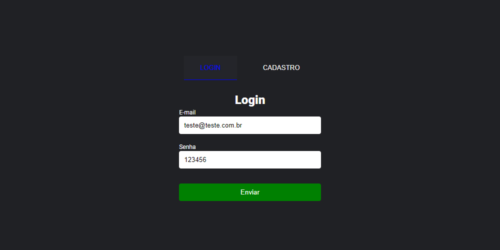

# Estudo - Login com PHP, TWIG, SLIM e ELOQUENT



## Como rodar a aplicação


1. Clone o repositório
```sh
https://github.com/Ricardofreitasdev/php-login-twig.git
```

2. Entre na pasta do projeto
```sh
cd php-login-twig
```

3. Instale as dependencias do node
```sh
npm install
```

4. Instale as dependencias do composer
```sh
composer install
```

5. Renomear o arquivo env.exemple.php para
```sh
env.php
```

6. Subir o servidor
```sh
php -S localhost:8000
```

7. Watch para minificar js e sass na pasta public, abrir novo terminal e digital
```sh
gulp
```

Dados de Login para teste

> Login: teste@teste.com | 
> Senha: 123456